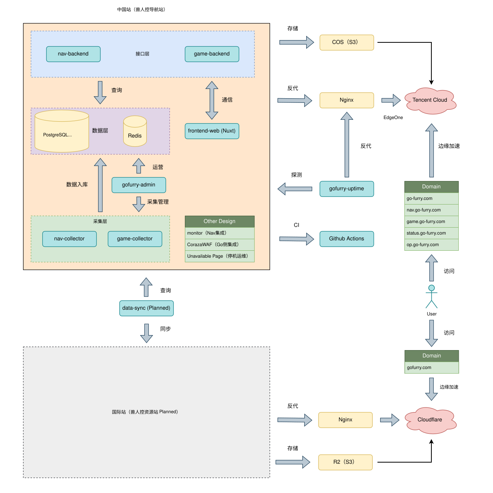

<p align="center">
  &nbsp;&nbsp;
  &nbsp;&nbsp;
  &nbsp;&nbsp;
  
</p>

<p align="center">
  ⭐🐺 <a href="./README_en.md">English</a> |
  <a href="https://go-furry.com">GoFurry 中国站</a> |
  <a href="https://gofurry.com">GoFurry 国际站</a> 🐺⭐
</p>

GoFurry 是一个面向兽圈文化内容发现、站点导航、兽游资料和可用性观测的开源多服务仓库。活跃生产代码位于 `apps/cn`，各服务独立开发和部署。

```text
                  ░██████             ░██████████                                        
                 ░██   ░██            ░██                                                
                ░██         ░███████  ░██        ░██    ░██ ░██░████ ░██░████ ░██    ░██ 
                ░██  █████ ░██    ░██ ░█████████ ░██    ░██ ░███     ░███     ░██    ░██ 
                ░██     ██ ░██    ░██ ░██        ░██    ░██ ░██      ░██      ░██    ░██ 
                ░██   ░███ ░██    ░██ ░██        ░██   ░███ ░██      ░██      ░██   ░███ 
                  ░█████░█  ░███████  ░██         ░█████░██ ░██      ░██       ░█████░██ 
                                                                                    ░██ 
                                                                              ░███████
```

## 项目范围

- `apps/cn/nav-web`：Nuxt 公开前端
- `apps/cn/nav-backend`：导航 API
- `apps/cn/nav-collector`：导航数据采集
- `apps/cn/game-backend`：兽游 API
- `apps/cn/game-collector`：Steam/兽游数据采集
- `apps/cn/admin`：嵌入前端的管理服务
- `apps/cn/uptime`：使用本地 Bbolt 的独立可用性观测服务

`apps/intl` 仅是国际站占位。`legacy`、`experimental` 和 `third-party` 不在活跃构建、CI 或生产部署图中。`db/game`、`db/nav` 和 `db/admin` 分别管理 `gfg`、`gfn` 和 `gfa` 的 Goose migrations。

## 架构概览

<p align="center">
  
</p>

> 国际站相关组件目前处于规划阶段，不属于当前生产运行拓扑。

## 技术栈

- Go / Fiber
- PostgreSQL / Redis
- Nuxt 4 / Vue 3
- Tailwind CSS / Less
- Coraza WAF
- Bbolt

## 快速开始

前端开发：

```bash
cd apps/cn/nav-web
npm install
npm run dev
```

Go 服务开发：

```bash
cd apps/cn/nav-backend
cp conf/server.example.yaml conf/server.yaml
# 编辑本地配置后：
go run . serve --config conf/server.yaml
```

六个 Go 程序的根命令只显示帮助；运行服务必须显式使用 `serve --config <file>`。示例配置只用于复制，不要提交真实密钥或凭据。

## 构建与验证

```bat
build.bat all
```

脚本仅构建六个活跃 Go 应用，产物输出到根目录 `build/`。Nav Web 使用其独立的 Node/Docker 流程。完整的开发和验证命令见 [本地开发文档](./docs/development.md) 和 [Agent playbook](./.agents/playbook.md)。

## 部署与运维

Nav Web 使用 [前端部署说明](./apps/cn/nav-web/DEPLOYMENT.md) 中的 Docker 流程。六个 Go 二进制使用内置的 Linux/systemd `install --config <file>` 和 `uninstall`；`install` 只 enable，不会启动服务。

数据库 migration 与二进制部署是独立的运维操作，应用启动时不执行 Goose。详见：

- [跨服务部署](./docs/deployment.md)
- [Linux/systemd 运维](./docs/operations/systemd.md)
- [数据库契约](./contracts/database.md)
- [可用性契约](./contracts/availability.md)

## 贡献

欢迎提交 Issue 和 Pull Request。请将改动限定在所属服务，遵循 [协作指南](./AGENTS.md)、[兼容性契约](./contracts/compatibility.md) 和 [已接受的架构决策](./docs/decisions/README.md)。

## 许可

本仓库采用 [MIT License](./LICENSE)。
